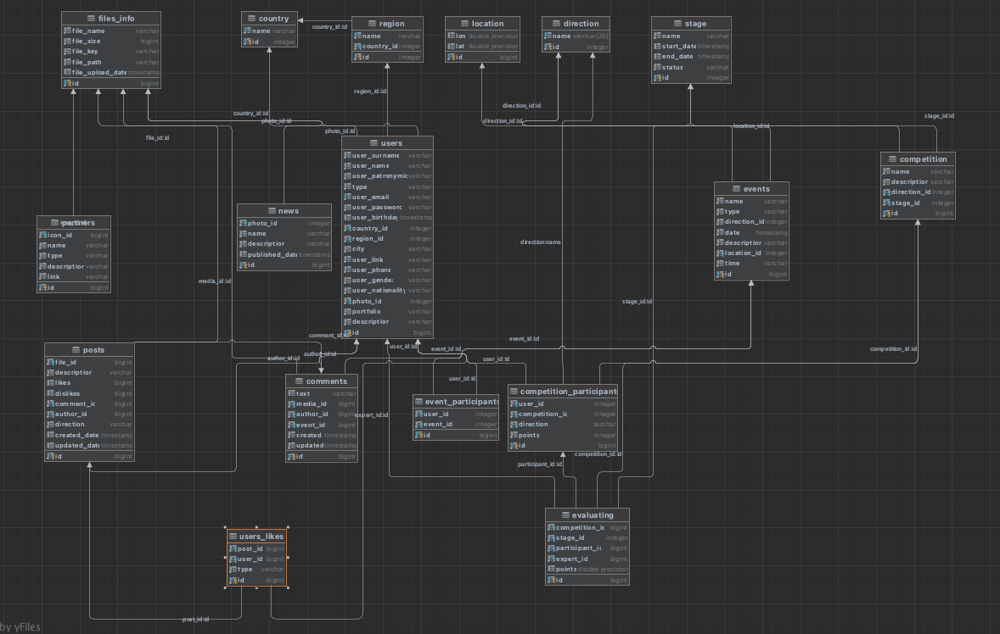

# Kardo App

Это бэкенд часть проекта Kardo Awards, позволяющая пользователям обмениваться фото, регистрироваться на мероприятия и конкурсы, смотреть прямые трансляции.
____
Команда проекта:

### PM
Дмитрий Лукьянов

### PdM
Данис

### Дизайн
Мария Крюкова

Екатерина

Анна

### Frontend
Алина Абрашкина

Полина Шмелева

### Backend
Галина Карлова

Ольга Шаталова

### QA
Кирилл Успенский

Павел Брюсов

____
Технологический стек:
* Java 17
* Spring Boot
* PostgreSQL
* Lombok
* Maven
* Hibernate
____

Для проекта предусмотрена спецификация API: http://localhost:8080/swagger-ui.html
____

В прооекте используется база данных Postgres.

____
# Установка и запуск проекта
1. Клонируйте репозиторий проекта на свою локальную машину
   https://github.com/gprovotorova/kardo.git

2. Зайдите в папку проекта в командой строке.

3. Соберите проект
   mvn clean package

5. Запустите приложение
   java -jar kardo-0.0.1-SNAPSHOT.jar